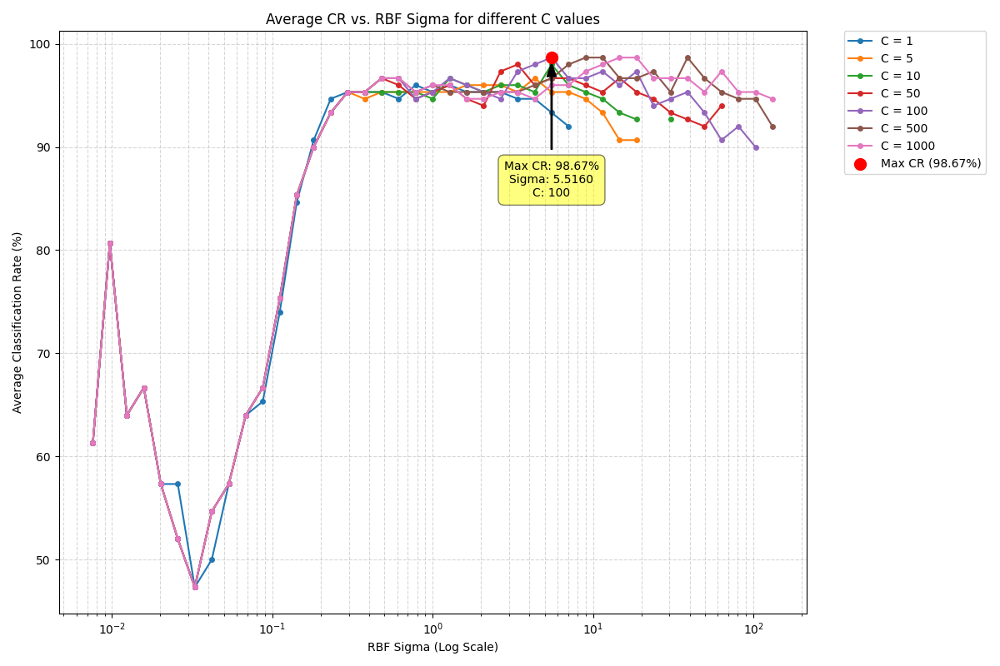
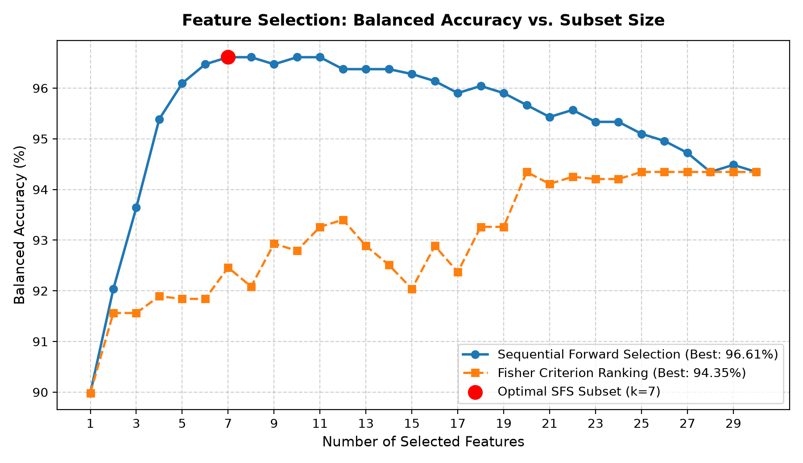

# Machine Learning: Optimization, Kernels & Feature Selection

A collection of machine learning algorithms, convex optimization solvers, and feature selection methods implemented in Python, with a focus on mathematical formulation and experimental evaluation.

---

## 📌 Project Overview

This repository contains implementations and experimental benchmarks for core machine learning paradigms:
- **Convex Optimization & Kernel SVM**: Dual Quadratic Programming (QP) formulation with RBF kernels and Karush-Kuhn-Tucker (KKT) conditions.
- **Dimensionality Reduction & Feature Selection**: Sequential Forward Selection (SFS) and Fisher's Criterion ranking on high-dimensional data.
- **Statistical Classification**: Custom implementations of Linear Discriminant Analysis (LDA), Quadratic Discriminant Analysis (QDA), Naive Bayes, and $k$-NN with stratified cross-validation.

---

## 📊 Experimental Results

### 1. RBF Kernel SVM via Quadratic Programming (QP)
* **Implementation**: Formulates the dual optimization problem and solves for Lagrange multipliers $\alpha_i$ under box constraints using a QP solver (`solve_qp`), extracting the bias $b$ via KKT conditions.
* **Hyperparameter Grid Search**: Evaluated over penalty parameter $C \in [1, 1000]$ and kernel bandwidth $\sigma \in [10^{-2}, 10^2]$.
* **Result**: Achieved a peak classification accuracy of **98.67%** at $C = 100$ and $\sigma \approx 5.5160$.



---

### 2. Feature Selection: SFS vs. Fisher's Criterion
* **Problem**: Selecting dominant features from a 30-dimensional dataset to optimize classification performance while reducing computational overhead.
* **Methods**:
  - **Sequential Forward Selection (SFS)**: Greedy search adding the feature that maximizes 2-fold stratified balanced accuracy.
  - **Fisher's Criterion Ranking**: Ranking features by class separation ratio $S_F = \frac{(\mu_1 - \mu_0)^2}{\sigma_1^2 + \sigma_0^2}$.
* **Result**: SFS reaches an optimal balanced accuracy of **96.61%** with just **7 features** (reducing dimensionality by >75%).



---

## 📁 Repository Structure

```
├── 01_discriminant_analysis_and_knn/    # LDA, QDA, Naive Bayes, and k-NN
│   ├── knn_lda_classifier.py
│   ├── hw2_1.py
│   ├── hw2_2.py
│   └── data/
├── 02_kernel_svm_qp_optimization/       # Dual QP SVM solver & hyperparameter grid search
│   ├── svm_rbf_qp_solver.py
│   └── results/
├── 03_feature_selection_and_ridge_lda/  # SFS and Fisher criterion feature selection
│   └── ridge_lda_feature_selection.py
├── docs/                                # Detailed reports & result figures
│   └── assets/
└── requirements.txt
```

---

## 🚀 Quickstart

### 1. Install Dependencies
```bash
pip install -r requirements.txt
```

### 2. Run Experiments

* **Feature Selection Benchmark (SFS vs. Fisher)**:
  ```bash
  python plot_hw4_results.py
  ```

* **RBF SVM Quadratic Programming Solver**:
  ```bash
  python 02_kernel_svm_qp_optimization/svm_rbf_qp_solver.py
  ```

* **k-NN & Linear Discriminant Analysis**:
  ```bash
  python 01_discriminant_analysis_and_knn/knn_lda_classifier.py
  ```

---

## 💡 Notes on Optimization & Engineering Relevance

The techniques implemented here—particularly **surrogate modeling via kernel methods**, **dual QP optimization**, and **greedy feature selection**—provide foundational tools for high-dimensional sensitivity analysis, design-space exploration, and parameter tuning in engineering workflows.
