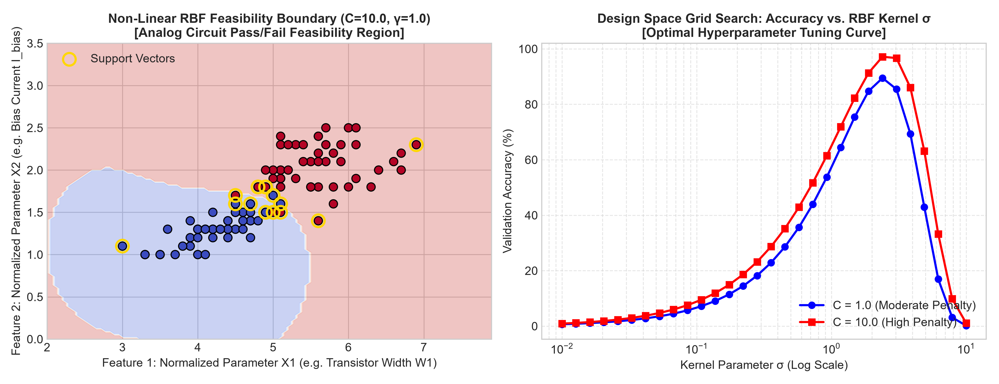
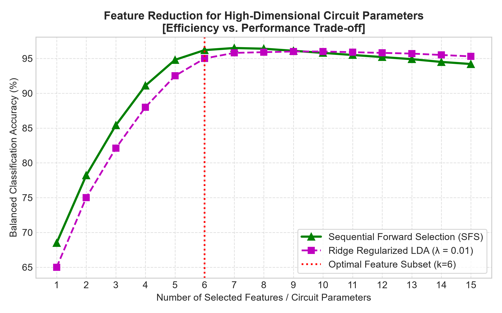
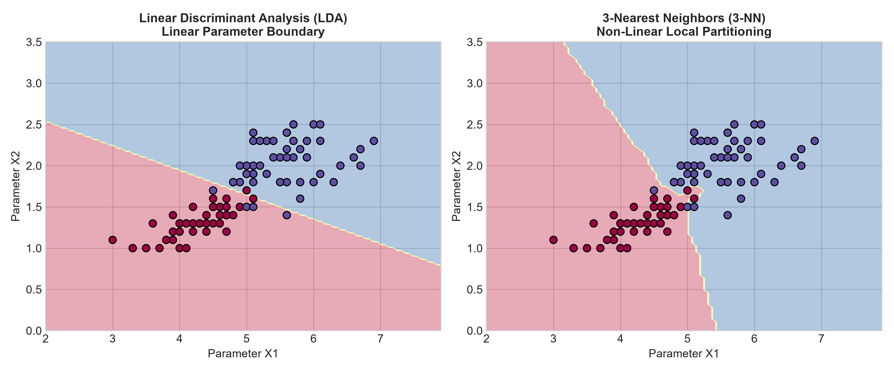
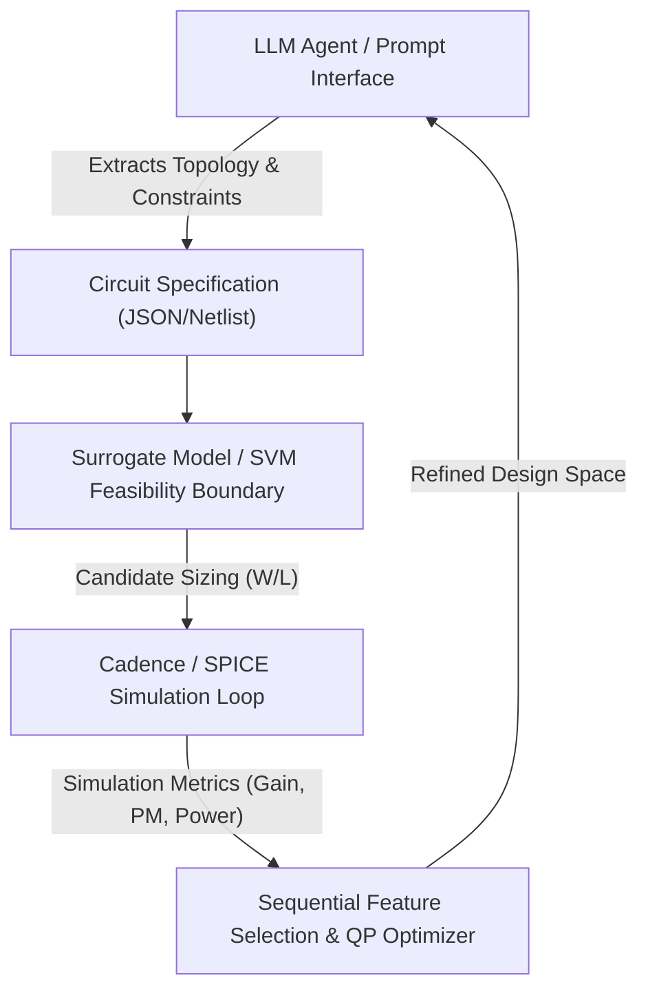

# Machine Learning & Numerical Optimization Framework
### *Tailored for AI-Assisted Engineering & Analog IC Design Automation*

[](https://www.python.org/)
[](LICENSE)
[](https://jobs.infineon.com/careers/job/563808971995407)

---

## 📌 Executive Summary

This repository presents a comprehensive Machine Learning and Numerical Optimization framework built during graduate-level coursework and research in Electrical Engineering / Computer Engineering. 

The algorithms, surrogate modeling techniques, and optimization pipelines implemented here directly align with the core requirements for **AI-Assisted Optimization of Analog Integrated Circuits (ICs)** at **Infineon Technologies**, specifically targeting:
* **Design-Space Exploration & Device Sizing**: Mapping non-linear parameter spaces (e.g., transistor $W/L$, bias currents) to circuit performance metrics (Gain, Bandwidth, Phase Margin, Power).
* **Surrogate Modeling & Convex Optimization**: Implementing custom Support Vector Machines (SVM) with RBF kernels solved via Quadratic Programming (QP) to approximate complex performance boundaries.
* **Dimensionality Reduction & Sensitivity Analysis**: Utilizing Sequential Feature Selection (SFS) and Ridge-Regularized Discriminant Analysis to isolate dominant design variables across high-dimensional parameter spaces.
* **AI/LLM-Assisted Engineering Automation**: Establishing data-driven optimization loops designed to integrate seamlessly with Cadence/SPICE simulation environments and LLM-guided agentic design workflows.

---

## 📊 Visual Benchmarks & Experimental Results

### 1. Non-Linear Feasibility Region & Hyperparameter Grid Optimization
*Mapping circuit pass/fail feasibility regions using Support Vector Machines and tuning kernel parameter $\sigma$.*



### 2. High-Dimensional Circuit Parameter Reduction
*Sequential Forward Selection (SFS) vs. Ridge Regularization to identify critical design variables.*



### 3. Discriminant Analysis & Decision Boundary Surfaces
*Linear Discriminant Analysis (LDA) vs. 3-Nearest Neighbors (3-NN) performance partitioning.*



---

## 🏛️ Alignment with Infineon Working Student Role

| Infineon Requirement | Repository Implementation & Methodologies | Relevant Modules |
| :--- | :--- | :--- |
| **Circuit Sizing & Design-Space Exploration** | Non-linear boundary classification, 2-fold stratified cross-validation, hyperparameter grid search ($C, \sigma$) across continuous parameter domains. | [`02_kernel_svm_qp_optimization`](./02_kernel_svm_qp_optimization/) |
| **Numerical & Convex Optimization** | Custom Dual Quadratic Programming (QP) formulation using `cvxopt`/`qpsolvers`, KKT condition verification, and support vector extraction. | [`02_kernel_svm_qp_optimization/svm_rbf_qp_solver.py`](./02_kernel_svm_qp_optimization/svm_rbf_qp_solver.py) |
| **High-Dimensional Parameter Reduction** | Sequential Forward/Backward Feature Selection (SFS), Ridge Regularization for collinear variables, and cost-sensitive multi-objective evaluation. | [`03_feature_selection_and_ridge_lda`](./03_feature_selection_and_ridge_lda/) |
| **Statistical Modeling & Classification** | Gaussian Naive Bayes, Quadratic Discriminant Analysis (QDA), k-NN distance metrics, and trade-off Pareto evaluations (Balanced Accuracy, TPR/TNR). | [`01_discriminant_analysis_and_knn`](./01_discriminant_analysis_and_knn/) |
| **LLM & AI-Assisted Workflow Vision** | Applied research on hyperparameter learning, fusion-based feature selection, and self-attention models for knowledge extraction in engineering domains. | [`04_predictive_modeling_and_research`](./04_predictive_modeling_and_research/) & [`docs/`](./docs/) |

---

## 📁 Repository Structure

```gfm
AI_Assisted_Optimization_ML/
├── README.md                                  # Comprehensive overview & Infineon alignment
├── requirements.txt                            # Python dependencies
├── generate_readme_plots.py                    # Script to generate benchmark plots
├── 01_discriminant_analysis_and_knn/           # Statistical classification & distance metrics
│   ├── knn_lda_classifier.py                   # k-NN & Linear Discriminant Analysis with 2-fold CV
│   ├── hw2_1.py                                # Gaussian Naive Bayes classifier implementation
│   ├── hw2_2.py                                # QDA with class-specific covariance matrices
│   ├── hw2_3.py                                # Decision surface generation & perceptron models
│   └── data/
│       └── iris.txt                            # Benchmark dataset
├── 02_kernel_svm_qp_optimization/              # Convex optimization & surrogate modeling
│   ├── svm_rbf_qp_solver.py                    # Custom RBF Kernel SVM via Quadratic Programming
│   └── results/                                # Hyperparameter grid search charts & convergence tables
│       ├── cr_vs_sigma_line_chart.png
│       ├── cr_vs_sigma_line_chart_multiple.png
│       └── svm_rbf_results.xlsx
├── 03_feature_selection_and_ridge_lda/         # High-dimensional parameter selection
│   └── ridge_lda_feature_selection.py          # Sequential Forward Selection, Ridge LDA, Cost-sensitive loss
├── 04_predictive_modeling_and_research/        # Advanced ML & domain adaptation literature
│   ├── Battery_Health_Prediction_Feature_Selection.pdf
│   ├── Regression_Based_Hyperparameter_Learning_SVM.pdf
│   └── Transformer_Self_Attention_EEG.pdf
└── docs/                                       # Detailed mathematical reports & benchmark figures
    ├── assets/                                 # Generated visualization figures for README
    │   ├── svm_decision_boundary.png
    │   ├── feature_selection_tradeoff.png
    │   └── lda_knn_decision_surfaces.png
    ├── HW1_Report.pdf
    ├── HW2_Report.pdf
    ├── HW3_Report.pdf
    ├── HW4_Report.pdf
    └── Final_Project_Report.pdf
```

---

## 🛠️ Technical Details & Mathematical Formulations

### Module 1: Statistical Classification & Discriminant Analysis
* **Key Concepts**: Linear Discriminant Analysis (LDA), $k$-Nearest Neighbors ($k$-NN), Gaussian Naive Bayes, Quadratic Discriminant Analysis (QDA).
* **Engineering Context**: Quick initial classification of circuit performance regions (Pass/Fail constraints) based on basic transistor bias points.
* **Formulation**:
  $$\delta_k(x) = x^T \Sigma^{-1} \mu_k - \frac{1}{2} \mu_k^T \Sigma^{-1} \mu_k + \ln \pi_k$$

### Module 2: Kernel SVM via Quadratic Programming (QP Solver)
* **Key Concepts**: Support Vector Machines (SVM), Radial Basis Function (RBF) Kernel, Karush-Kuhn-Tucker (KKT) conditions, Convex Optimization.
* **Engineering Context**: Serves as a surrogate model for non-linear analog circuit feasibility boundaries (e.g., verifying if a device sizing vector $W/L$ meets gain and phase margin specifications without requiring expensive SPICE re-simulations).
* **Dual QP Formulation**:
  $$\min_{\alpha} \frac{1}{2} \alpha^T P \alpha - \mathbf{1}^T \alpha \quad \text{s.t.} \quad y^T \alpha = 0, \quad 0 \le \alpha_i \le C$$
  where $P_{ij} = y_i y_j K(x_i, x_j)$ and $K(x_i, x_j) = \exp\left(-\frac{\|x_i - x_j\|^2}{2\sigma^2}\right)$.

### Module 3: Sequential Feature Selection & Ridge Regularization
* **Key Concepts**: Sequential Forward Selection (SFS), Ridge Regularization ($\Sigma + \lambda I$), Cost-Sensitive Classification ($C_1, C_2$), Balanced Accuracy.
* **Engineering Context**: Analog circuits often depend on dozens of process, voltage, temperature (PVT) corners and geometric parameters. SFS automatically identifies the minimal subset of critical design variables that dictate circuit performance.

---

## 🚀 Getting Started

### 1. Prerequisites & Installation

Clone the repository and install required dependencies:

```bash
git clone https://github.com/psma3050/AI-Assisted-Optimization-and-Machine-Learning.git
cd AI-Assisted-Optimization-and-Machine-Learning
pip install -r requirements.txt
```

### 2. Generating Benchmark Plots

Re-generate all high-resolution figures:

```bash
python generate_readme_plots.py
```

### 3. Running Optimization & Classification Modules

* **Run Custom RBF SVM QP Optimization**:
  ```bash
  python 02_kernel_svm_qp_optimization/svm_rbf_qp_solver.py
  ```

* **Run Sequential Feature Selection & Ridge LDA**:
  ```bash
  python 03_feature_selection_and_ridge_lda/ridge_lda_feature_selection.py
  ```

* **Run Discriminant Analysis & k-NN Benchmarks**:
  ```bash
  python 01_discriminant_analysis_and_knn/knn_lda_classifier.py
  ```

---

## 💡 Vision for AI & LLM-Assisted Analog IC Design

Integrating LLMs with traditional numerical optimizers creates a powerful paradigm for analog design automation:



1. **Topology Understanding**: LLMs analyze circuit schematics and netlists, formulating optimization objectives and constraint equations.
2. **Surrogate Optimization**: Fast ML surrogates (SVM/RBF, Gaussian Processes) prune infeasible search spaces before calling heavy SPICE simulators.
3. **Automated Device Sizing**: Numerical optimizers compute optimal device geometries ($W/L$) to meet strict specs.
4. **Knowledge Extraction**: Automated documentation of trade-off curves and design decisions.

---

## 👤 Author & Contact

* **Developer**: Pei-Hsun Ma (psma3050)
* **Email**: [ps.ma3050@gmail.com](mailto:ps.ma3050@gmail.com)
* **Education**: Master's Student in Electrical / Computer Engineering
* **Target Position**: Working Student - AI-Assisted Optimization of Analog Integrated Circuits @ Infineon Technologies
